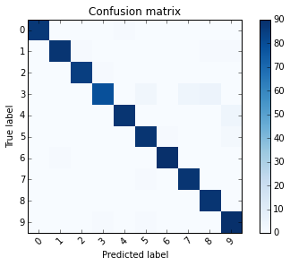

+<script>
 +MathJax.Hub.Queue(["Typeset",MathJax.Hub]);
 +</script>
##分類法/範例一: Recognizing hand-written digits

http://scikit-learn.org/stable/auto_examples/classification/plot_digits_classification.html

這個範例用來展示scikit-learn 機器學習套件，如何用SVM演算法來達成手寫的數字辨識

1. 利用 `make_classification` 建立模擬資料
2. 利用 `sklearn.datasets.load_digits()` 來讀取內建資料庫
3. 用線性的SVC來做分類，以8x8的影像之像素值來當作特徵(共64個特徵)
4. 用 `metrics.classification_report` 來提供辨識報表


## (一)引入函式庫及內建手寫數字資料庫

引入之函式庫如下

1. matplotlib.pyplot: 用來繪製影像
2. sklearn.datasets: 用來繪入內建之手寫數字資料庫
3. sklearn.svm: SVM 支持向量機之演算法物件
4. sklearn.metrics: 用來評估辨識準確度以及報表的顯示

```python
import matplotlib.pyplot as plt
from sklearn import datasets, svm, metrics

# The digits dataset
digits = datasets.load_digits()
```

使用`datasets.load_digits()`將資料存入，`digits`為一個dict型別資料，我們可以用以下指令來看一下資料的內容。

```python
for key,value in digits.items() :
    try:
        print (key,value.shape)
    except:
        print (key)
```


| 顯示 | 說明 |
| -- | -- |
| ('images', (1797L, 8L, 8L))| 共有 1797 張影像，影像大小為 8x8 |
| ('data', (1797L, 64L)) | data 則是將8x8的矩陣攤平成64個元素之一維向量 |
| ('target_names', (10L,)) | 說明10種分類之對應 [0, 1, 2, 3, 4, 5, 6, 7, 8, 9] |
| DESCR | 資料之描述 |
| ('target', (1797L,))| 記錄1797張影像各自代表那一個數字 |


接下來我們試著以下面指令來觀察資料檔，每張影像所對照的實際數字存在`digits.target`變數中

```python
images_and_labels = list(zip(digits.images, digits.target))
for index, (image, label) in enumerate(images_and_labels[:4]):
    plt.subplot(2, 4, index + 1)
    plt.axis('off')
    plt.imshow(image, cmap=plt.cm.gray_r, interpolation='nearest')
    plt.title('Training: %i' % label)
```


##(二)訓練以及分類
接下來的步驟則是使用`reshape`指令將8x8的影像資料攤平成64x1的矩陣。
接著用`classifier = svm.SVC(gamma=0.001)`產生一個SVC分類器(Support Vector Classification)。再將一半的資料送入分類器來訓練`classifier.fit(資料:898x64, 分類目標:898x1)`。SVC之預設kernel function為RBF (radial basis function): $$\exp(-\gamma |x-x'|^2)$$. 其中`SVC(gamma=0.001)`就是在設定RBF函數裏的$$\gamma$$ 這個值必需要大於零。最後，再利用後半部份的資料來測試訓練完成之SVC分類機`predict(data[n_samples / 2:])`將預測結果存入`predicted`變數，而原先的真實目標資料則存於`expected`變數，用於下一節之準確度統計。

```python
n_samples = len(digits.images)

# 資料攤平:1797 x 8 x 8 -> 1797 x 64
# 這裏的-1代表自動計算，相當於 (n_samples, 64)
data = digits.images.reshape((n_samples, -1))

# 產生SVC分類器
classifier = svm.SVC(gamma=0.001)

# 用前半部份的資料來訓練
classifier.fit(data[:n_samples / 2], digits.target[:n_samples / 2])

expected = digits.target[n_samples / 2:]

#利用後半部份的資料來測試分類器，共 899筆資料
predicted = classifier.predict(data[n_samples / 2:])
```

若是觀察 `expected` 及 `predicted` 矩陣中之前10個變數可以得到:
* `expected[:10]` :[8 8 4 9 0 8 9 8 1 2]
* `predicted[:10]`:[8 8 4 9 0 8 9 8 1 2]

這說明了前10個元素中，我們之前訓練完成的分類機，正確的分類了手寫數字資料。那對於全部測試資料的準確度呢？要如何量測？

##(三)分類準確度統計
那在判斷準確度方面，我們可以使用一個名為「混淆矩陣」(Confusion matrix)的方式來統計。

```python
print("Confusion matrix:\n%s"
    % metrics.confusion_matrix(expected, predicted))
```
使用sklearn中之metrics物件，`metrics.confusion_matrix(真實資料:899, 預測資料:899)`可以列出下面矩陣。此矩陣對角線左上方第一個數字 87，代表實際為0且預測為0的總數有87個，同一列(row)第五個元素則代表，實際為0但判斷為4的資料個數為1個。
```
Confusion matrix:
[[87  0  0  0  1  0  0  0  0  0]
 [ 0 88  1  0  0  0  0  0  1  1]
 [ 0  0 85  1  0  0  0  0  0  0]
 [ 0  0  0 79  0  3  0  4  5  0]
 [ 0  0  0  0 88  0  0  0  0  4]
 [ 0  0  0  0  0 88  1  0  0  2]
 [ 0  1  0  0  0  0 90  0  0  0]
 [ 0  0  0  0  0  1  0 88  0  0]
 [ 0  0  0  0  0  0  0  0 88  0]
 [ 0  0  0  1  0  1  0  0  0 90]]
```
我們可以利用以下的程式碼將混淆矩陣圖示出來。由圖示可以看出，實際為3時，有數次誤判為5,7,8。

```python
def plot_confusion_matrix(cm, title='Confusion matrix', cmap=plt.cm.Blues):
    import numpy as np
    plt.imshow(cm, interpolation='nearest', cmap=cmap)
    plt.title(title)
    plt.colorbar()
    tick_marks = np.arange(len(digits.target_names))
    plt.xticks(tick_marks, digits.target_names, rotation=45)
    plt.yticks(tick_marks, digits.target_names)
    plt.tight_layout()
    plt.ylabel('True label')
    plt.xlabel('Predicted label')

plt.figure()
plot_confusion_matrix(metrics.confusion_matrix(expected, predicted))
```


以手寫影像3為例，我們可以用四個數字來探討判斷的精準度。

1. True Positive(TP,真陽):實際為3且判斷為3，共79個
2. False Positive(FP,偽陽):判斷為3但判斷錯誤，共2個
3. False Negative(FN,偽陰):實際為3但判斷錯誤，共12個
4. True Negative(TN,真陰):實際不為3，且判斷正確。也就是其餘899-79-2-12=885個

而在機器學習理論中，我們通常用以下precision, recall, f1-score來探討精確度。以手寫影像3為例。

* precision = TP/(TP+FP) = 79/81 = 0.98
* 判斷為3且實際為3的比例為0.98
* recall = TP/(TP+FN) = 79/91 = 0.87
* 實際為3且判斷為3的比例為0.87
* f1-score 則為以上兩者之「harmonic mean 調和平均數」
* f1-score= 2 x precision x recall/(recision + recall) = 0.92

metrics物件裏也提供了方便的函式`metrics.classification_report(expected, predicted)`計算以上統計數據。

```python
print("Classification report for classifier %s:\n%s\n"
    % (classifier, metrics.classification_report(expected, predicted)))
```
此報表最後的 support，則代表著實際為手寫數字的總數。例如實際為3的數字共有91個。
```
             precision    recall  f1-score   support

          0       1.00      0.99      0.99        88
          1       0.99      0.97      0.98        91
          2       0.99      0.99      0.99        86
          3       0.98      0.87      0.92        91
          4       0.99      0.96      0.97        92
          5       0.95      0.97      0.96        91
          6       0.99      0.99      0.99        91
          7       0.96      0.99      0.97        89
          8       0.94      1.00      0.97        88
          9       0.93      0.98      0.95        92

avg / total       0.97      0.97      0.97       899
```
最後，用以下的程式碼可以觀察測試影像以及預測(分類)結果得對應關係。

```python
images_and_predictions = list(
                        zip(digits.images[n_samples / 2:], predicted))
for index, (image, prediction) in enumerate(images_and_predictions[:4]):
    plt.subplot(2, 4, index + 5)
    plt.axis('off')
    plt.imshow(image, cmap=plt.cm.gray_r, interpolation='nearest')
    plt.title('Prediction: %i' % prediction)

plt.show()
```


##(四)完整程式碼
Python source code: plot_digits_classification.py

http://scikit-learn.org/stable/_downloads/plot_digits_classification.py

```python
print(__doc__)

# Author: Gael Varoquaux <gael dot varoquaux at normalesup dot org>
# License: BSD 3 clause

# Standard scientific Python imports
import matplotlib.pyplot as plt

# Import datasets, classifiers and performance metrics
from sklearn import datasets, svm, metrics

# The digits dataset
digits = datasets.load_digits()

# The data that we are interested in is made of 8x8 images of
# digits, let's # have a look at the first 3 images, stored in
# the `images` attribute of the # dataset.  If we were working
# from image files, we could load them using # pylab.imread.
# Note that each image must have the same size. For these  images,
#we know which digit they represent: it is given in the 'target' of
# the dataset.
images_and_labels = list(zip(digits.images, digits.target))
for index, (image, label) in enumerate(images_and_labels[:4]):
    plt.subplot(2, 4, index + 1)
    plt.axis('off')
    plt.imshow(image, cmap=plt.cm.gray_r, interpolation='nearest')
    plt.title('Training: %i' % label)

# To apply a classifier on this data, we need to flatten the image, to
# turn the data in a (samples, feature) matrix:
n_samples = len(digits.images)
data = digits.images.reshape((n_samples, -1))

# Create a classifier: a support vector classifier
classifier = svm.SVC(gamma=0.001)

# We learn the digits on the first half of the digits
classifier.fit(data[:n_samples / 2], digits.target[:n_samples / 2])

# Now predict the value of the digit on the second half:
expected = digits.target[n_samples / 2:]
predicted = classifier.predict(data[n_samples / 2:])

print("Classification report for classifier %s:\n%s\n"
    % (classifier, metrics.classification_report(expected, predicted)))
print("Confusion matrix:\n%s"
    % metrics.confusion_matrix(expected, predicted))

images_and_predictions = list(
                        zip(digits.images[n_samples / 2:], predicted))
for index, (image, prediction) in enumerate(images_and_predictions[:4]):
    plt.subplot(2, 4, index + 5)
    plt.axis('off')
    plt.imshow(image, cmap=plt.cm.gray_r, interpolation='nearest')
    plt.title('Prediction: %i' % prediction)

plt.show()
```
