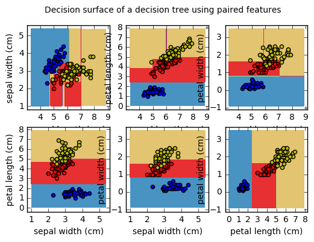

## 決策樹/範例三: Plot the decision surface of a decision tree on the iris dataset
http://scikit-learn.org/stable/auto_examples/tree/plot_iris.html#sphx-glr-auto-examples-tree-plot-iris-py

此範例利用決策樹分類器將資料集進行分類，找出各類別的分類邊界。以鳶尾花資料集當作範例，每次取兩個特徵做訓練，個別繪製不同品種的鳶尾花特徵的分布範圍。對於每對的鳶尾花特徵，決策樹學習推斷出簡單的分類規則，構成決策邊界。

### 範例目的：
1. 資料集：iris 鳶尾花資料集
2. 特徵：鳶尾花特徵
3. 預測目標：是哪一種鳶尾花
4. 機器學習方法：decision tree 決策樹

### (一)引入函式庫及內建測試資料庫

* `from sklearn.datasets import load_iris`將鳶尾花資料庫存入，`iris`為一個dict型別資料。<br />
* 每筆資料中有4個特徵，一次取2個特徵，共有6種排列方式。<br />
* X (特徵資料) 以及 y (目標資料)。<br />
* `DecisionTreeClassifier` 建立決策樹分類器。<br />

```python
import numpy as np
import matplotlib.pyplot as plt

from sklearn.datasets import load_iris
from sklearn.tree import DecisionTreeClassifier

iris = load_iris()

for pairidx, pair in enumerate([[0, 1], [0, 2], [0, 3],
                                [1, 2], [1, 3], [2, 3]]):
    X = iris.data[:, pair]
    y = iris.target
```

### (二)建立`Decision Tree`分類器
#### 建立模型及分類器訓練
* `DecisionTreeClassifier()`:決策樹分類器。<br />
* `fit(特徵資料, 目標資料)`：利用特徵資料及目標資料對分類器進行訓練。<br />

```python
clf = DecisionTreeClassifier().fit(X, y)
```

### (三)繪製決策邊界及訓練點
* `np.meshgrid`：利用特徵之最大最小值，建立預測用網格 xx, yy <br />
* `clf.predict`：預估分類結果。 <br />
* `plt.contourf`：繪製決策邊界。 <br />
* `plt.scatter(X,y)`：將X、y以點的方式繪製於平面上，c為數據點的顏色，label為圖例。<br />

```python
plt.subplot(2, 3, pairidx + 1)

x_min, x_max = X[:, 0].min() - 1, X[:, 0].max() + 1
y_min, y_max = X[:, 1].min() - 1, X[:, 1].max() + 1

xx, yy = np.meshgrid(np.arange(x_min, x_max, plot_step),
                     np.arange(y_min, y_max, plot_step))


Z = clf.predict(np.c_[xx.ravel(), yy.ravel()]) #np.c_ 串接兩個list,np.ravel將矩陣變為一維

Z = Z.reshape(xx.shape)

cs = plt.contourf(xx, yy, Z, cmap=plt.cm.Paired)

plt.xlabel(iris.feature_names[pair[0]])
plt.ylabel(iris.feature_names[pair[1]])
plt.axis("tight")

for i, color in zip(range(n_classes), plot_colors):
    idx = np.where(y == i)
    plt.scatter(X[idx, 0], X[idx, 1], c=color, label=iris.target_names[i],
                cmap=plt.cm.Paired)

plt.axis("tight")
```



### (四)完整程式碼
```python
print(__doc__)

import numpy as np
import matplotlib.pyplot as plt

from sklearn.datasets import load_iris
from sklearn.tree import DecisionTreeClassifier

# Parameters
n_classes = 3
plot_colors = "bry"
plot_step = 0.02

# Load data
iris = load_iris()

for pairidx, pair in enumerate([[0, 1], [0, 2], [0, 3],
                                [1, 2], [1, 3], [2, 3]]):

    # We only take the two corresponding features
    X = iris.data[:, pair]
    y = iris.target
    # Train
    clf = DecisionTreeClassifier().fit(X, y)

    # Plot the decision boundary
    plt.subplot(2, 3, pairidx + 1)

    x_min, x_max = X[:, 0].min() - 1, X[:, 0].max() + 1
    y_min, y_max = X[:, 1].min() - 1, X[:, 1].max() + 1

    xx, yy = np.meshgrid(np.arange(x_min, x_max, plot_step),
                         np.arange(y_min, y_max, plot_step))


    Z = clf.predict(np.c_[xx.ravel(), yy.ravel()]) #np.c_ 串接兩個list,np.ravel將矩陣變為一維

    Z = Z.reshape(xx.shape)


    cs = plt.contourf(xx, yy, Z, cmap=plt.cm.Paired)

    plt.xlabel(iris.feature_names[pair[0]])
    plt.ylabel(iris.feature_names[pair[1]])
    plt.axis("tight")


    # Plot the training points
    for i, color in zip(range(n_classes), plot_colors):
        idx = np.where(y == i)
        plt.scatter(X[idx, 0], X[idx, 1], c=color, label=iris.target_names[i],
                    cmap=plt.cm.Paired)

    plt.axis("tight")

plt.suptitle("Decision surface of a decision tree using paired features")
plt.legend()
plt.show()
```


```python

```
