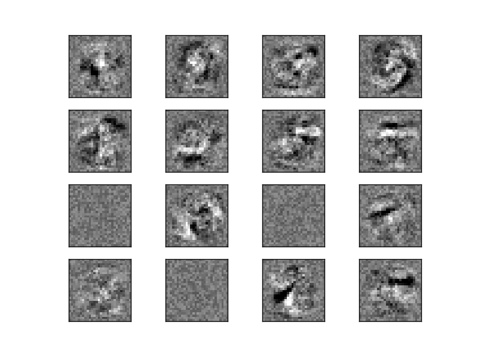

```python
%matplotlib inline
```


# Visualization of MLP weights on MNIST


此範例將使用MNIST dataset的訓練資料集去訓練MLPClassifier，資料集中每張圖片都是28\*28，對於第一層的每個神經元都會有28\*28個特徵，輸出結果是將訓練資料的每個像素點對於神經元的權重畫成28*28的圖，用來表示圖片上每個像素點對於神經元的權重多寡。
### (一)引入函式庫與資料
1.matplotlib.pyplot:用來繪製影像
2.sklearn.datasets:引入內建的手寫數字資料庫
3.sklearn.neural_network:引入類神經網路的套件
```python
import matplotlib.pyplot as plt 
from sklearn.datasets import fetch_mldata
from sklearn.neural_network import MLPClassifier
mnist = fetch_mldata("MNIST original")
```
### (二)將資料切割成訓練集與測試集
```python
# 將灰階影像降尺度降到[0,1]
X, y = mnist.data / 255., mnist.target
X_train, X_test = X[:60000], X[60000:]
y_train, y_test = y[:60000], y[60000:]
```
### (三)設定分類器參數與訓練網路並畫出權重矩陣

```python
#hidden_layer_sizes=(50)此處使用1層隱藏層，只有50個神經元，max_iter=10疊代訓練10次
mlp = MLPClassifier(hidden_layer_sizes=(50), max_iter=10, alpha=1e-4,
                    solver='sgd', verbose=10, tol=1e-4, random_state=1,
                    learning_rate_init=.1)

mlp.fit(X_train, y_train)
#畫出16個神經元的權重圖，黑色表示負的權重，越深色表示數值越大，白色表示正的權重，越淺色表示數值越大
fig, axes = plt.subplots(4, 4)
# use global min / max to ensure all weights are shown on the same scale
vmin, vmax = mlp.coefs_[0].min(), mlp.coefs_[0].max()
for coef, ax in zip(mlp.coefs_[0].T, axes.ravel()):
    ax.matshow(coef.reshape(28, 28), cmap=plt.cm.gray, vmin=.5 * vmin,
               vmax=.5 * vmax)
    ax.set_xticks(())
    ax.set_yticks(())

plt.show()
```

<center>圖1:16個神經元對於影像的權重圖</center>

<center>圖2:疊代計算時loss下降</center>


### (四)完整程式碼
```python
print(__doc__)

import matplotlib.pyplot as plt
from sklearn.datasets import fetch_mldata
from sklearn.neural_network import MLPClassifier

mnist = fetch_mldata("MNIST original")

X, y = mnist.data / 255., mnist.target
X_train, X_test = X[:60000], X[60000:]
y_train, y_test = y[:60000], y[60000:]


mlp = MLPClassifier(hidden_layer_sizes=(50), max_iter=10, alpha=1e-4,
                    solver='sgd', verbose=10, tol=1e-4, random_state=1,
                    learning_rate_init=.1)

mlp.fit(X_train, y_train)
print("Training set score: %f" % mlp.score(X_train, y_train))
print("Test set score: %f" % mlp.score(X_test, y_test))

fig, axes = plt.subplots(4, 4)

vmin, vmax = mlp.coefs_[0].min(), mlp.coefs_[0].max()
for coef, ax in zip(mlp.coefs_[0].T, axes.ravel()):
    ax.matshow(coef.reshape(28, 28), cmap=plt.cm.gray, vmin=.5 * vmin,
               vmax=.5 * vmax)
    ax.set_xticks(())
    ax.set_yticks(())

plt.show()
```
