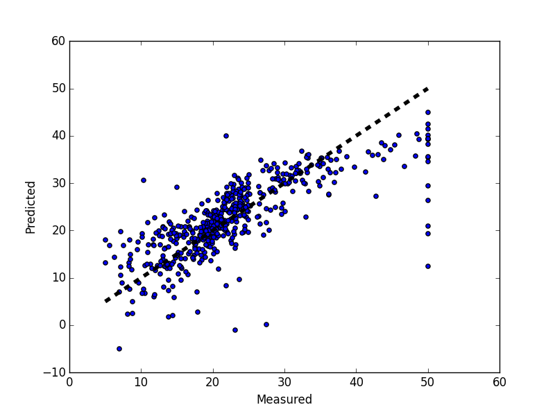

##通用範例/範例一: Plotting Cross-Validated Predictions

http://scikit-learn.org/stable/auto_examples/plot_cv_predict.html

1. 資料集：波士頓房產
2. 特徵：房地產客觀數據，如年份、平面大小
3. 預測目標：房地產價格
4. 機器學習方法：線性迴歸
5. 探討重點：10 等分的交叉驗証(10-fold Cross-Validation)來實際測試資料以及預測值的關係
6. 關鍵函式： `sklearn.cross_validation.cross_val_predict`

## (一)引入函式庫及內建測試資料庫

引入之函式庫如下

1. `matplotlib.pyplot`: 用來繪製影像
2. `sklearn.datasets`: 用來繪入內建測試資料庫
3. `sklearn.cross_validation import cross_val_predict`：利用交叉驗證的方式來預測
4. `sklearn.linear_model`：使用線性迴歸


## (二)引入內建測試資料庫(boston房產資料)
使用 `datasets.load_boston()` 將資料存入， `boston` 為一個dict型別資料，我們看一下資料的內容。

```python
lr = linear_model.LinearRegression()
#lr = LinearRegression(copy_X=True, fit_intercept=True, n_jobs=1, normalize=False)
boston = datasets.load_boston()
y = boston.target
```

| 顯示 | 說明 |
| -- | -- |
| ('data', (506, 13))| 機器學習數據 |
| ('feature_names', (13,)) |  |
| ('target', (506,)) | 回歸目標 |
| DESCR | 資料之描述 |


## (三)用`sklearn.cross_validation.cross_val_predict`產生估計值

`sklearn.cross_validation.cross_val_predict`(estimator, X, y=None, cv=None, n_jobs=1, verbose=0, fit_params=None, pre_dispatch='2*n_jobs')[source]

X為機器學習數據，
y為回歸目標，
cv為疊代次數。
```python
predicted = cross_val_predict(lr, boston.data, y, cv=10)
```

## (四)繪出預測結果與實際目標差異圖
X軸為回歸目標，Y軸為預測結果。

並劃出一條斜率=1的理想曲線(用虛線標示)
```python
fig, ax = plt.subplots()
ax.scatter(y, predicted)
ax.plot([y.min(), y.max()], [y.min(), y.max()], 'k--', lw=4)
ax.set_xlabel('Measured')
ax.set_ylabel('Predicted')
plt.show()
```



## (五)完整程式碼
Python source code: plot_cv_predict.py

http://scikit-learn.org/stable/auto_examples/plot_cv_predict.html
```python
from sklearn import datasets
from sklearn.cross_validation import cross_val_predict
from sklearn import linear_model
import matplotlib.pyplot as plt

lr = linear_model.LinearRegression()
boston = datasets.load_boston()
y = boston.target

# cross_val_predict returns an array of the same size as `y` where each entry
# is a prediction obtained by cross validated:
predicted = cross_val_predict(lr, boston.data, y, cv=10)

fig, ax = plt.subplots()
ax.scatter(y, predicted)
ax.plot([y.min(), y.max()], [y.min(), y.max()], 'k--', lw=4)
ax.set_xlabel('Measured')
ax.set_ylabel('Predicted')
plt.show()
```
