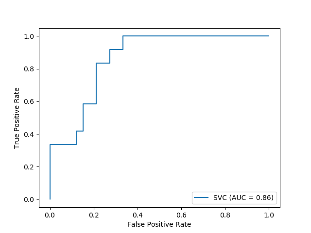

# **範例五:ROC Curve with Visualization API**

https://scikit-learn.org/stable/auto_examples/plot_roc_curve_visualization_api.html

Scikit-learn定義了一個簡單的API，用於創建機器學習的可視化。該API的主要功能是無需重新計算即可進行快速繪圖和視覺調整。在此範例中，我們將通過比較ROC曲線來展示如何使用可視化API。


## (一)載入資料以及訓練SVC

首先，我們載入`load_wine`，它主要為一個典型且簡單的多分類資料庫，並將它轉換為二進位制的分類問題。

```python
import matplotlib.pyplot as plt
from sklearn.svm import SVC
from sklearn.ensemble import RandomForestClassifier
from sklearn.metrics import plot_roc_curve
from sklearn.datasets import load_wine
from sklearn.model_selection import train_test_split

X, y = load_wine(return_X_y=True)
y = y == 2
```
對於訓練資料訓練一個SVC。

```python
X_train, X_test, y_train, y_test = train_test_split(X, y, random_state=42)
svc = SVC(random_state=42)
svc.fit(X_train, y_train)
```

## (二)繪製ROC曲線

使用`sklearn.metrics.plot_roc_curve`來繪製ROC曲線，回傳的`svc_disp`對象使我們可以在以後的圖中繼續使用已經計算出的ROC曲線。

```python
svc_disp = plot_roc_curve(svc, X_test, y_test)
plt.show()
```


