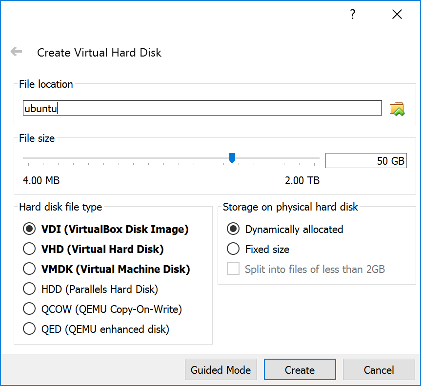
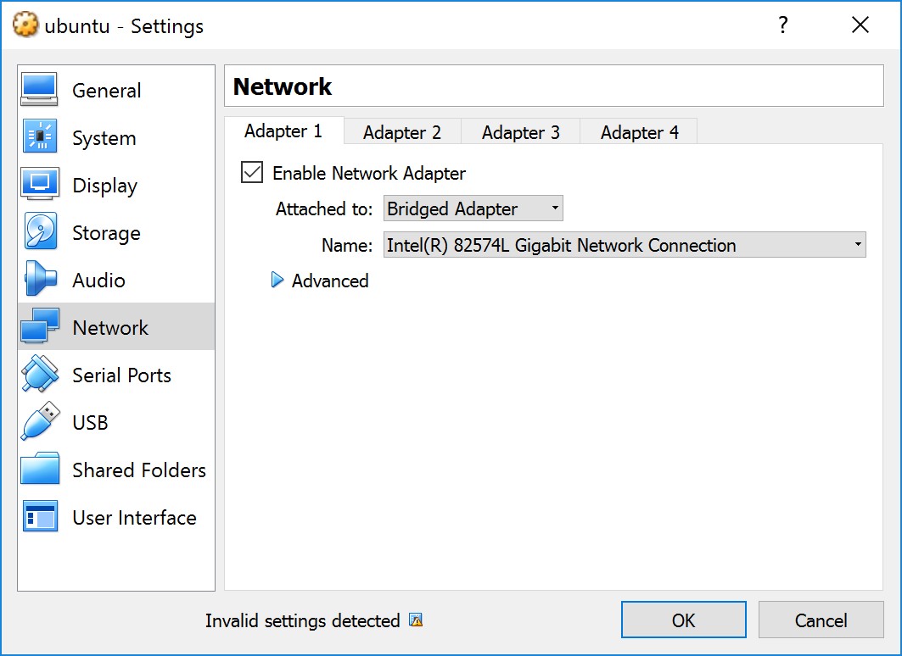

# 機器學習：使用 NVIDIA Jetson TX2

## 從零開始

灌作業系統一定是我們的首要目標，但在這之前，我們要先有一台運行 Ubuntu x64 (14.04或更新) 的電腦，可以用虛擬機來代替。

沒有虛擬機的朋友可以用[VirtualBox](https://www.virtualbox.org/wiki/Downloads)。

Ubuntu x64 的映像檔可以在[這邊](https://www.ubuntu.com/download/desktop)下載。

### 1. 安裝 VirtualBox

流程就不在這邊贅述，簡單來說，就是狂按下一步

### 2. 安裝 Ubuntu x64

有兩點要注意：

1. 因為稍後下載回來的安裝包還會有額外的下載與編譯，所以硬碟空間要大一些，建議設定在 **50G** 以上。
    

2. 在設定 TX2 的時候，需要將 TX2 連上與 Ubuntu x64 相同的區網，進行這項設定，請：

    1. 開啟 Ubuntu x64 的虛擬機設定
    2. 進入網路設定
    3. 將網路連線方式選擇**橋接**，並指定成用來上網的網路介面
        

## 讓 TX2 動起來

基本上外部的設置已經完成了，接下來就要把目光開始轉移到 TX2 上面。

這邊我們會用到名為 Jet Pack 的官方套件，在[這邊](https://developer.nvidia.com/jetson-development-pack)可以下載他。

### 1. 執行 JetPack

注意：**這個套件要在 Ubuntu x64 上才能執行**

首先，我們需要更改 JetPack 的權限，讓他可以執行：

1. 開啟 JetPack 所在的資料夾
2. 點右鍵，選`Open in Terminal`
3. 執行`chmod +x JetPack-<VERSION>.run`，其中的`<VERSION>`請替換成你所下載的版本號。（可以按`tab`讓系統自動補齊檔案名稱）

基本上接下來按照指示操作即可，當出現 Terminal 視窗時：

1. 除了要將 TX2 準備在旁邊之外，你還會需要：可以和隨附的變壓器搭配的**電源線**、隨附的**micro-USB線**、夠長且良好的**網路線**、可以用**HDMI**或有HDMI轉接線可以搭配的**螢幕**、**鍵盤**、**滑鼠**
2. 將 TX2 接上**電源**、用**micro-USB**把 TX2 和 Ubuntu x64 連在一起、**網路線**接到和 Ubuntu x64 相同的區域網路下
3. 在按按鈕之前，先來介紹按鈕的作用

    

    在**電源**接頭**對角**處有**1個_螺絲_**和**4顆_按鈕_**，他們分別是

    |螺絲|重設|自訂|復原|電源|
    |---|---|---|---|---|

4. 按下**電源**開機
5. 按住**復原**別放開
6. 按下**重設**進入復原模式
7. 可以放開**復原**鍵
8. 確定 Ubuntu x64 有成功辨識 TX2，名稱會有 **NVIDIA** 或 **Jetson** 或 **TX2** 字樣
9. 在 Terminal 內按下`enter`鍵，繼續程序
10. 等待完成的訊息出現

### 2. 安裝環境

先來列出預設的帳號與密碼：

|帳號|密碼|
|---|---|
|nvidia|nvidia|
|ubuntu|ubuntu|

接下來的事情，我們都會在 Terminal 裡面完成：

1. 先更新系統

    ```sh
    $ sudo apt-get update
    $ sudo apt-get upgrade -y
    ```

2. 接著安裝常用的套件

    ```sh
    $ sudo apt-get install curl vim git mercurial silversearcher-ag htop python3-pip
    $ pip3 install --upgrade pip
    $ pip3 install virtualenv numpy
    ```

3. (Optional)安裝更方便的 zsh

    ```sh
    $ sudo apt-get install zsh
    $ sh -c "$(curl -fsSL https://raw.githubusercontent.com/robbyrussell/oh-my-zsh/master/tools/install.sh)"
    ```

## 安裝 OpenCV

既然 TX2 上面有相機模組，那我們就來裝個 OpenCV 來做相機的影像處理吧！

Python3 會是我們的主要語言。

1. 安裝依賴套件

    ```sh
    $ sudo apt-get install build-essential cmake git pkg-config libjpeg8-dev libtiff5-dev libjasper-dev libpng12-dev libavcodec-dev libavformat-dev libswscale-dev libv4l-dev libgtk2.0-dev libatlas-base-dev gfortran
    ```

2. 取得 OpenCV 原始碼

    ```sh
    $ git clone git://github.com/Itseez/opencv
    $ cd opencv
    $ git checkout <你所要用的 OpenCV 版本，建議是用最新版>
    $ git clone git://github.com/Itseez/opencv_contrib
    $ cd opencv_contrib
    $ git checkout <你所要用的 OpenCV 版本，建議是用最新版>
    ```

3. 編譯 OpenCV

    ```sh
    $ mkdir opencv/build
    $ cd opencv/build
    $ cmake \
      -D CMAKE_BUILD_TYPE=RELEASE \
      -D CMAKE_INSTALL_PREFIX=/usr/local \
      -D INSTALL_PYTHON_EXAMPLES=ON \
      -D OPENCV_EXTRA_MODULES_PATH=<opencv_contrib 所在的完整路徑> \
      -D BUILD_EXAMPLES=ON ..
    $ make -j4
    $ sudo make install
    $ sudo ldconfig
    ```

4. 安裝 OpenCV

    1. 建立虛擬開發環境

        ```sh
        $ virtualenv OpenCV
        ```

    2. 進入虛擬開發環境

        ```sh
        $ cd OpenCV
        $ source bin/active
        ```

    3. 找到 OpenCV

        ```sh
        $ ls -al /usr/local/lib/python<Python3 的版本號，如：3.5>/dist-packages/cv2*
        ```

    4. 連接 OpenCV 到虛擬環境

        ```sh
        $ ln -s <上一步驟印出的完整路徑> lib/python<Python3 的版本號，如：3.5>/site-packages/cv2.so
        ```

    5. 測試 OpenCV

        ```py
        import cv2
        cv2.__version__
        ```

        輸出

        ```
        '<OpenCV 的版本號>'
        ```

## 安裝 TensorFlow

1. 安裝依賴套件

    ```sh
    $ sudo apt-get install default-jdk libcupti-dev
    $ export JAVA_HOME='/usr/lib/jvm/java-8-openjdk-arm64/'
    ```

2. 取得 TensorFlow 編譯腳本

    ```sh
    $ git clone git://github.com/jetsonhacks/installTensorFlowTX2
    $ cd installTensorFlowTX2
    ```

3. 執行編譯腳本

    ```sh
    $ ./installPrerequisitesPy3.sh
    $ ./cloneTensorFlow.sh
    $ ./setTensorFlowEVPy3.sh
    $ ./buildTensorFlow.sh
    $ ./packageTensorFlow.sh
    ```

4. 安裝 TensorFlow

    1. 建立虛擬開發環境

        ```sh
        $ virtualenv TensorFlow
        ```

    2. 進入虛擬開發環境

        ```sh
        $ cd TensorFlow
        $ source bin/active
        ```

    3. 安裝 TensorFlow 到虛擬環境

        ```sh
        pip3 install $HOME/<TensorFlow 的 .whl 安裝封包>
        ```

    4. 測試 TensorFlow

        1. Hello World

            ```py
            import tensorflow as tf
            hello = tf.constant('Hello, TensorFlow on NVIDIA Jetson TX2!')
            sess = tf.Session()
            print(sess.run(hello))
            ```

            輸出
    
            ```
            Hello, TensorFlow on NVIDIA Jetson TX2!
            ```

        2. 運算單元

            ```py
            import tensorflow as tf
            # Creates a graph.
            a = tf.constant([1.0, 2.0, 3.0, 4.0, 5.0, 6.0], shape=[2, 3], name='a')
            b = tf.constant([1.0, 2.0, 3.0, 4.0, 5.0, 6.0], shape=[3, 2], name='b')
            c = tf.matmul(a, b)
            # Creates a session with log_device_placement set to True.
            sess = tf.Session(config=tf.ConfigProto(log_device_placement=True))
            # Runs the op.
            print(sess.run(c))
            ```

            輸出
    
            ```
            name: NVIDIA Tegra X2
            major: 6 minor: 2 memoryClockRate (GHz) 1.3005
            MatMul: (MatMul): /job:localhost/replica:0/task:0/gpu:0
            b: (Const): /job:localhost/replica:0/task:0/gpu:0
            a: (Const): /job:localhost/replica:0/task:0/gpu:0
            [[ 22.  28.]
            [ 49.  64.]]
            ```
